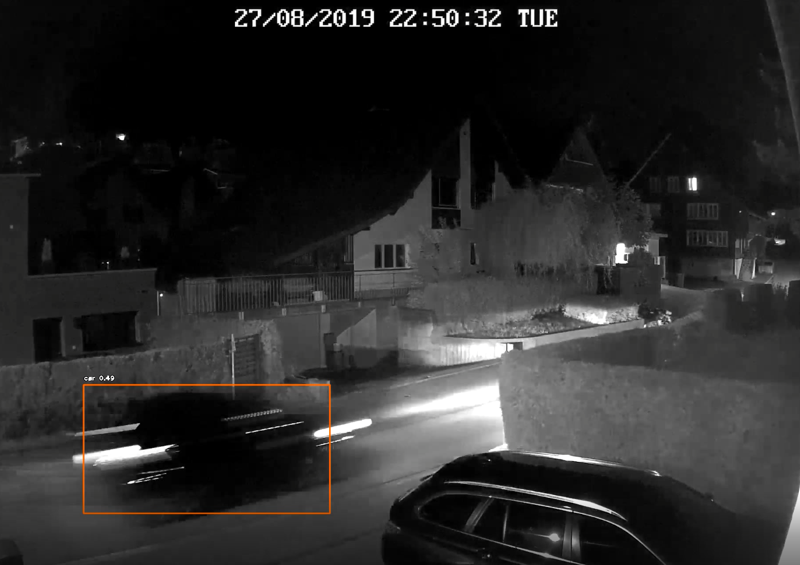

# sgv-opencv-videorecognition
Python based script to solve the problem of how to stream RTSP and run Open CV

# My Street

                                                

# Drake Yolo(5)

                                         

                                                
# Zurich Video Trams

# Zurich in the past

                                                 

# Zurich Video Paradeplatz

                                                   
# Cows

